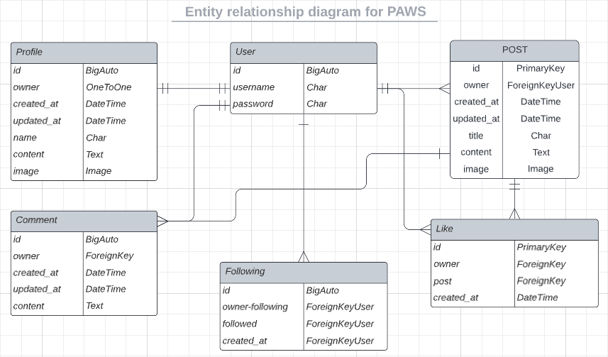
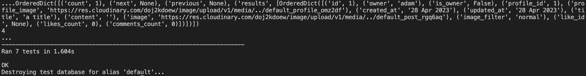

# Paws

Paws is a photo-sharing social networking service on which users can interact with each other by following other users and commenting on or liking their posts. This app is aimed at dog owners, and users are encouraged to share dog-related content. 

## Quick links

[Deployed app](https://paws-frontend.herokuapp.com/)

[Backend repository](https://github.com/axelzwaans/paws-backend)

[Backend deployed](https://paws-backend-api.herokuapp.com/)

## Database

I added a graphical representation in the form of an entity-relationship model to depict the relationship between entities within my models. I used Lucidchart to design it.

## Features

The models as displayed above work together nicely to create a simple social media app. Users can create profiles, create posts, like and comment on other user's posts, and follow other users to see their content in their feed.

- **Profiles** - Used to store information about each user, such as their username and profile picture. This information is used to identify the user throughout the app.

- **Posts** - Used to store the actual content that users create, such as photos or text. Each post is associated with a specific user, using a foreign key relationship between the "profiles" and "posts" models.

- **Likes** - Used to keep track of which users have liked a particular post. This model uses foreign keys to connect the "profiles" and "posts" models.

- **Followers** - Used to keep track of which users are following each other. This model uses a many-to-many relationship between the "profiles" model and itself, with an intermediary table to store additional information such as the date the following occurred.

- **Comments** - Used to store any comments that users leave on a post. This model is associated with both the "profiles" and "posts" models using foreign keys.

## Main technologies used

- **Python** - A high-level, interpreted programming language known for its simplicity, readability, and vast range of libraries and frameworks.

- **Django** - A high-level Python web framework that enables rapid development of secure and maintainable web applications.

- **Django Rest Framework** - A powerful and flexible toolkit for building Web APIs, which extends Django to provide an easy-to-use platform for building RESTful services.

- **Heroku** - A cloud platform as a service (PaaS) that allows me to build, deploy, and scale web applications easily and quickly.

- **Cloudinary** - A cloud-based media management solution that provides a comprehensive image and video platform for web and mobile applications.

- **Pillow** - A Python Imaging Library that adds support for opening, manipulating, and saving many different image file formats, making it easier to work with images in Python.

- **PostgreSQL** - An open-source, object-relational database management system that provides reliability, robustness, and scalability for storing and managing large amounts of data.

- **LucidChart** - A cloud-based diagramming and visual communication app on which I created my entity relationship diagram.

- **ElephantSQL** - A cloud-based PostgreSQL database service that provides managed, scalable, and highly available databases.

## Testing

### Manual testing

This manual test report covers the testing of my Django app which includes models for profiles, posts, followers, comments, and likes. The app was tested manually to ensure that all features and functionalities work correctly.

| Test scenario | Test steps | Expected results | Result |
|-|-|-|-|
| User Registration and Login | Enter a valid password and username on the registration form and click on the submit button | User account is created successfully | PASS
| User Registration and Login | Enter an invalid email address on the registration form and click on the submit button | User account is not created, and an error message is displayed | PASS
| User Registration and Login | Enter a username that already exists on the registration form and click on the submit button | User account is not created, and an error message is displayed | PASS
| User Registration and Login | Enter a valid username and password on the login form and click on the login button | User is logged in successfully | PASS
| User Registration and Login | Enter an invalid username or password on the login form and click on the login button. | User is not logged in, and an error message is displayed | PASS
| User Registration and Login | Check if profile is automatically created upon registration | Profile is made | PASS
| Post Creation and Update | Enter valid details on the post creation form and click on the submit button | Post is created successfully | PASS
| Post Creation and Update | Enter new valid details on the post update form and click on the save button | Post is updated successfully | PASS
| Follow and Unfollow | Click on the follow button for a user | User is added to the follower list | PASS
| Follow and Unfollow | Click on the unfollow button for a user | User is removed from the follower list | PASS
| Comment Creation and Update | Enter valid details on the comment creation form and click on the submit button | Comment is created successfully | PASS
| Comment Creation and Update | Enter new valid details on the comment update form and click on the save button | Comment is updated successfully | PASS
| Like and Unlike | Click on the like button for a post | Like count is incremented by 1 | PASS
| Like and Unlike | Click on the unlike button for a post | Like count is decremented by 1 | PASS

### Automated testing

For good measure, I added some automated tests to the posts app. These tests included:

- List posts.
- Logged in user can create post.
- Logged out user can't create post.
- User can retrieve post using valid id.
- User can't retrieve post using invalid id.
- User can update own post.
- User can't update another user's post.

The results of the tests came out as follows:

### CI Python Linter

I ran all Python files through the CI Python Linter ensuring that my code is clean, consistent, and adheres to best practices. No significant errors were detected. 

## Deployment

This project has been successfully deployed to Heroku, here are the steps I took:

1. In the terminal of my IDE workspace, install gunicorn. 

3. Create a Procfile and populate it with the template given by CI.

4. Make the necessary changes to my settings.py file as instructed by the walkthrough project.

5. Generate the necessary files for Heroku to install project dependencies by executing the command "pip3 freeze --local > requirements.txt". Add this file to the .gitignore file to prevent it from being committed.

6. Add, commit and push my code to GitHub.

4. Log in to Heroku.com and create a new app by selecting "Create New App" from the New dropdown menu. Provide a unique name and select your working region.

5. Navigate to the Settings tab and set the following environment variables:

- ALLOWED_HOST: set the value as the name of my project with '.herokuapp.com' appended to the end (e.g. example-app.herokuapp.com).

- CLOUDINARY_URL: set the value as my cloudinary API environment variable

- SECRET_KEY: make one up, but don’t use the one that was originally in the settings.py file

- DATABASE_URL: ensure that this key is already populated. It should have been created automatically by Heroku.

- CLIENT_ORIGIN: set value to the URL I will be sending the authentication request from to make authenticated requests to the API. 

- CLIENT_ORIGIN_DEV: key with the value of a development server for use during local development.

8. In the Deploy tab, connect my Heroku account to my GitHub repository by following the on-screen instructions. Choose to deploy my project manually or automatically.

9. Click the Deploy Branch button to initiate the deployment process. Once the build is complete, click the View button to open my application.

## Credits

I used the Code Institute "drf-api" walkthrough project to guide me through building this API.

